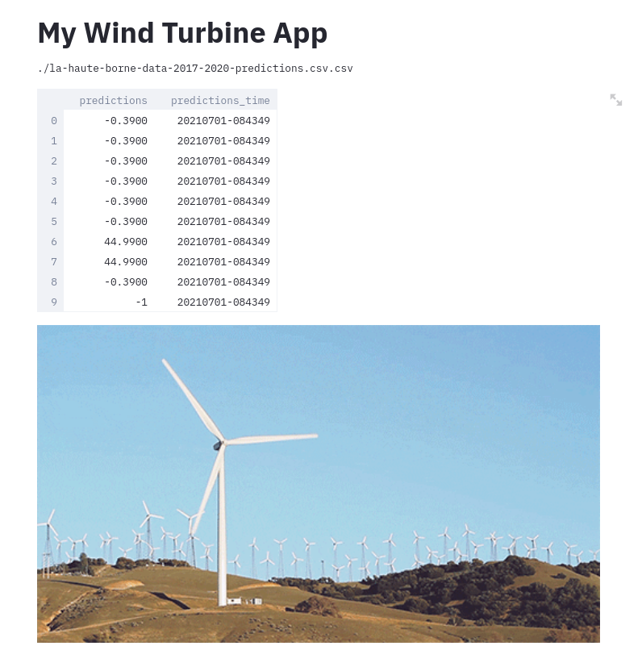

summary: TP7 - Exposition de modèles
id: tp7
categories: tp, api
tags: api, flask
status: Published
authors: OCTO Technology
Feedback Link: https://gitlab.com/octo-technology/octo-bda/cercle-formation/dsin2/-/issues/new

# TP7 - Exposition de modèles

## Overview
Duration: 1

### A l'issue de cette section, vous aurez découvert

- Comment fonctionne une simple API Flask,
- Le pattern d'exposition `embedded model`,
- Le pattern d'exposition `model as a service`,
- Le pattern d'exposition `model published as data`,

### Présentation des nouveautés sur la branche de ce TP

Pour ce TP, utiliser la branch 7_starting_exposition

`git checkout 7_starting_exposition`

Sur cette branche, il y a maintenant : 
- Un dossier exposition qui contient trois format d'expositions
- `embedded_model` une app streamlit qui permet de demander des prédictions
- `exposing_predictions` une app streamlit qui permet de voir les prédictions réalisées précédement
- `model_as_a_service` une api flask qui permet de demander des prédictions 

## Développement d'API avec Flask

Flask est un microserveur d'application. Il est souvent utilisé en Python pour développer des APIs et exposer des ressources.

### Exposition "model as a service"

- Se rendre dans `dsin2-public-ocac/exposition/model_as_a_service/`
- Démarrer le serveur Flask d'exposition avec `FLASK_APP=inference.py python -m flask run`

Le serveur d'exposition est désormais disponible sur le port 5000 <http://localhost:5000>, avec:

- la route de healthcheck `/health` pour vérifier que le service est fonctionnel,
- la route `/predict` pour demander une prédiction
  - Il est possible de demander une prédiction en spécifiant une valeur pour la feature explicative `Ws1_avg`

⚠ Le serveur Flask ne sera pas consultable dans votre navigateur !

Dans votre terminal, avec l'outil en ligne de commande `cURL`, réalisez les requêtes HTTP suivantes:

- explorez le code de l'API Flask dans `dsin2/exposition/model_as_a_service/inference.py`,
- requêtez l'url de `healthcheck` du service pour s'assurer qu'il fonctionne (<http://localhost:5000/health>),
- requêtez une prédiction sur <http://localhost:5000/predict>,
- requêtez une prédiction pour une `Wind Speed` de 0, 10, 50, 100.

Pour spécifier une valeur de `Wind Speed` il faut ajouter `?Ws1_avg=<Your value>` à l'adresse
## Démo: Exposition | model as a service

> La manipulation sera faite par les formateurs

Dans le dossier `exposition/` se trouvent un fichier `docker-compose.yaml`, exécutable avec `docker-compose up`.

Une fois lancée, l'application streamlit est accessible sur <http://localhost:8092> et le service Flask est disponible sur <http://localhost:5000/health>.

Dans le dossier `exposition/model_as_a_service/` se trouve la définition de ces 2 services:

- une application de dashboarding construite avec Streamlit dans `app.py`,
- un service d'inférence construit avec Flask dans `inference.py`.

L'application streamlit permet d'afficher une prédiction à la demande selon la valeur de `Ws1_avg` spécifiée par l'utilisateur.

- Modifier la valeur de `Wind Speed Average` à 0, 10, 20, 50, 100 et demander une prédiction
- Observer les logs de docker-compose, et constater que le service Flask réalise les prédictions quand Streamlit les demande.

## Démo: Exposition | embedded model

> La manipulation sera faite par les formateurs

Dans le dossier `exposition/` se trouvent un fichier `docker-compose.yaml`, exécutable avec `docker-compose up`.

Une fois lancée, l'application streamlit avec modèle embarqué est accessible sur <http://localhost:8091>.

Dans le dossier `exposition/embedded_model/` se trouve la définition de ce service de dashboarding:

- une application de dashboarding construite avec Streamlit dans `embedded_model.py`,
- il n'y a pas de service d'inférence.

L'application streamlit permet d'afficher une prédiction à la demande selon la valeur de `Ws1_avg` spécifiée par l'utilisateur.

- Modifier la valeur de `Wind Speed Average` à 0, 10, 20, 50, 100 et demander une prédiction
- Observer les logs de docker-compose, et constater que le service Flask ne réalise pas de prédictions quand Streamlit les demande.

## Démo: Exposition | Exposing predictions

> La manipulation sera faite par les formateurs

Dans le dossier `exposition/` se trouvent un fichier `docker-compose.yaml`, exécutable avec `docker-compose up`.

Une fois lancée, l'application streamlit est accessible sur <http://localhost:8090>.

Dans le dossier `exposition/exposing_predictions/` se trouve la définition de ce service de dashboarding dans `display_predictions.py`.

L'application streamlit affiche des prédictions déjà réalisées.

